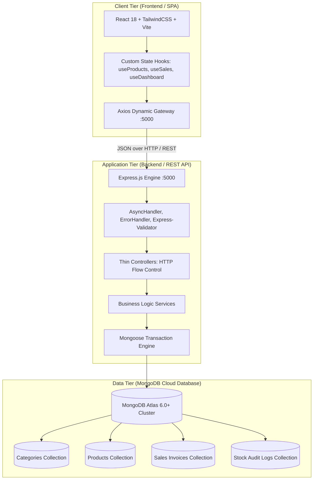

# ⚡ Nandhipriya Electricals — Stock Management & Billing System
> **Production-Grade Full-Stack Enterprise Inventory & Point-of-Sale (POS) Application**  
> *Engineered for High-Concurrency Counter Sales, Real-time Stock Auditing, and GST Compliance.*

[](https://github.com/naveencmy/stock-flow/actions/workflows/ci.yml)
[](https://nodejs.org/)
[](https://react.dev/)
[](https://expressjs.com/)
[](https://www.mongodb.com/atlas)
[](https://www.docker.com/)

---

## 🏛️ System Architecture Overview

The system follows a decoupled **3-Tier Client-Server Architecture** adhering to **Separation of Concerns (SoC)**, **ACID Multi-Document Transactions**, and **Zero Static Mock Data Dependency**:



---

## 🗂️ Project Directory Structure

```
HardWareKits_v0.1/
├── backend/
│   ├── config/
│   │   └── db.js                 # Resilient MongoDB Atlas connection with process hooks
│   ├── controllers/              # Thin HTTP boundary (req/res payload transport)
│   │   ├── categoryController.js
│   │   ├── dashboardController.js
│   │   ├── productController.js
│   │   ├── saleController.js
│   │   └── stockLogController.js
│   ├── middleware/               # Fail-safe pipeline
│   │   ├── asyncHandler.js       # Higher-order async exception wrapper
│   │   ├── errorHandler.js       # Centralized error classifier (CastError, ValidationError)
│   │   └── validate.js           # express-validator strict typing & range bounds
│   ├── models/                   # Mongoose ODM schemas & compound indexes
│   │   ├── Category.js           # Case-insensitive collation unique index
│   │   ├── Product.js            # 2-decimal precision, virtual `isLowStock`, text search index
│   │   ├── Sale.js               # Embedded snapshot items, phone regex, unique bill sequence
│   │   └── StockLog.js           # Immutable inventory movement audit log
│   ├── routes/                   # REST Route mappings
│   ├── services/                 # Pure business logic & ACID transaction engine
│   │   ├── categoryService.js
│   │   ├── dashboardService.js   # MongoDB aggregation pipelines
│   │   ├── productService.js
│   │   ├── saleService.js        # Mongoose session multi-document atomic transactions
│   │   └── stockLogService.js
│   ├── utils/
│   │   ├── autoIncrement.js      # Collision-free sequential bill generator (B-00001)
│   │   └── seedData.js           # Enterprise dataset: 5 categories, 15 realistic products
│   ├── test-all-endpoints.js     # Automated 22-endpoint verification suite
│   ├── Dockerfile                # Production multi-stage Alpine container
│   ├── package.json
│   └── server.js                 # Application bootstrap & health checks
├── frontend/
│   ├── src/
│   │   ├── api/
│   │   │   ├── axiosConfig.js    # Intercepted HTTP client with automatic toast notifications
│   │   │   └── services.js       # Pure dynamic service layer with response unboxing
│   │   ├── components/           # Reusable UI component library (POS Cart, Tables, Modals)
│   │   ├── hooks/                # Stateful controllers (useProducts, useSales, useDashboard)
│   │   ├── pages/                # Views: Billing, Dashboard, Products, SalesHistory, StockLogs
│   │   ├── App.jsx               # Client-side router definition
│   │   └── main.jsx              # DOM mount point
│   ├── nginx.conf                # High-performance SPA routing & Gzip compression
│   ├── Dockerfile                # Multi-stage Vite build -> Nginx Alpine runtime
│   ├── package.json
│   └── vite.config.js
├── .github/workflows/
│   └── ci.yml                    # Automated CI/CD testing & verification pipeline
├── docker-compose.yml            # Production container orchestration
├── docker-compose.dev.yml        # Development environment with live hot-reload
├── render.yaml                   # Infrastructure-as-Code for Render Cloud deployment
├── vercel.json                   # Vercel SPA routing rewrite rules
└── STUDENT_OBL_ARCHITECTURE_GUIDE.md # 3rd-Year CSE Outcome-Based Learning reference
```

---

## 📡 REST API Specification (22 Endpoints)

### 1. Products (`/api/products`)
| Method | Endpoint | Query / Body | Description |
| :--- | :--- | :--- | :--- |
| `GET` | `/` | `search, category, page, limit, lowStock` | List products with text search, category filters & pagination |
| `GET` | `/low-stock` | — | Filter products where `stockQty <= reorderLevel` |
| `GET` | `/:id` | — | Get single product by MongoDB ObjectId |
| `POST` | `/` | `{ name, category, brand, unit, unitPrice, stockQty, reorderLevel, gstRate, barcode }` | Create product entry |
| `PUT` | `/:id` | Delta update fields | Update product details with validator triggers |
| `DELETE` | `/:id` | — | **Soft-delete** product (sets `isActive: false`) |

### 2. Categories (`/api/categories`)
| Method | Endpoint | Query / Body | Description |
| :--- | :--- | :--- | :--- |
| `GET` | `/` | — | List all categories sorted alphabetically |
| `GET` | `/:id` | — | Get single category details |
| `POST` | `/` | `{ name, description }` | Create unique category |
| `PUT` | `/:id` | `{ name, description }` | Update category name / description |
| `DELETE` | `/:id` | — | **Referential Integrity Block**: Blocks deletion if child products exist |

### 3. Sales & Billing (`/api/sales`)
| Method | Endpoint | Query / Body | Description |
| :--- | :--- | :--- | :--- |
| `POST` | `/` | `{ customerName, customerPhone, items, discountAmt, paymentMethod }` | **ACID Atomic Sale Creation**: Validates stock, snapshots price/GST, generates `B-00001`, decrements stock, records audit logs |
| `GET` | `/` | `from, to, search, page, limit` | List sales ledger with date range filtering |
| `GET` | `/today` | — | Today's aggregate sales count and total revenue |
| `GET` | `/stats` | — | Lifetime total sales, total revenue, and average bill value |
| `GET` | `/:id` | — | Get full invoice with populated product metadata |
| `GET` | `/:id/pdf` | — | Structured JSON invoice optimized for client-side PDF rendering |

### 4. Stock Audit Logs (`/api/stock-logs`)
| Method | Endpoint | Query / Body | Description |
| :--- | :--- | :--- | :--- |
| `GET` | `/` | `product, changeType, page, limit` | List audit movements with type and item filters |
| `GET` | `/product/:productId` | — | Chronological inventory movement history for a specific item |
| `POST` | `/adjust` | `{ productId, qtyChange, note }` | Manual stock balance adjustment with audit logging |

### 5. Analytics Dashboard (`/api/dashboard`)
| Method | Endpoint | Description |
| :--- | :--- | :--- |
| `GET` | `/summary` | High-level KPIs: `totalProducts`, `lowStockCount`, `todayRevenue`, `todayBillsCount`, `monthlyRevenue`, `monthlyBillsCount` |
| `GET` | `/revenue-chart` | 30-day daily revenue bucket array for trend visualizations |

---

## 🔒 ACID Atomic Sale Creation Pattern

The billing engine executes inside a single Mongoose Transaction Session to prevent partial inventory corruption during concurrent checkouts:

```javascript
// Step 1: Initialize transaction session
const session = await mongoose.startSession();
session.startTransaction();

try {
  // Step 2: Validate live stock & snapshot item pricing/GST
  // Step 3: Compute subTotal, totalGst, and grandTotal
  // Step 4: Generate sequential billNumber (B-00001)
  // Step 5: Persist Sale Document
  // Step 6: Decrement Product.stockQty atomically
  // Step 7: Append StockLog audit movement entry
  // Step 8: Commit transaction
  await session.commitTransaction();
} catch (error) {
  // Rollback all operations on failure
  await session.abortTransaction();
  throw error;
} finally {
  session.endSession();
}
```

---

## 🚀 Quick Start Guide

### Prerequisites
- **Node.js**: `18.x LTS` or higher
- **MongoDB**: MongoDB Atlas URI or local MongoDB 6.0+ instance

### 1. Clone & Configure Environment
```bash
git clone https://github.com/naveencmy/stock-flow.git
cd stock-flow
```

Create `backend/.env`:
```env
NODE_ENV=development
PORT=5000
MONGODB_URI=mongodb+srv://<username>:<password>@cluster0.mongodb.net/nandhipriya_electricals?retryWrites=true&w=majority
```

Create `frontend/.env`:
```env
VITE_API_URL=http://localhost:5000/api
```

### 2. Install Dependencies & Seed Data
```bash
# Backend setup
cd backend
npm install
npm run seed     # Seeds 5 categories and 15 products

# Frontend setup
cd ../frontend
npm install
```

### 3. Run Development Servers
```bash
# Terminal 1: Backend API (Port 5000)
cd backend
npm run dev

# Terminal 2: Frontend Client (Port 5173)
cd frontend
npm run dev
```

### 4. Execute Automated Test Suite
```bash
cd backend
npm run test:all
```

---

## 🐳 Docker & DevOps Deployment

### Production Deployment via Docker Compose
```bash
# Builds optimized Alpine images and boots MongoDB ReplicaSet, Backend API, and Nginx SPA
docker-compose up -d --build
```
- **Frontend SPA**: `http://localhost` (Port 80)
- **Backend API**: `http://localhost:5000`
- **MongoDB**: `localhost:27017`

### Development Mode via Docker Compose
```bash
# Live hot-reloading with host volume mounting
docker-compose -f docker-compose.dev.yml up
```

---

## ☁️ Cloud Deployment (Render & Vercel)

### Deploy Backend to Render.com
1. Connect repository on [Render Dashboard](https://dashboard.render.com).
2. Use **`render.yaml`** or create a **Web Service**:
   - **Root Directory**: `backend`
   - **Build Command**: `npm install`
   - **Start Command**: `npm start`
   - **Environment Variables**:
     - `MONGODB_URI` = Your MongoDB Atlas Connection String
     - `NODE_ENV` = `production`
     - `PORT` = `5000`

### Deploy Frontend to Vercel
1. Import repository on [Vercel](https://vercel.com).
2. Configure project settings:
   - **Framework Preset**: `Vite`
   - **Root Directory**: `frontend`
   - **Build Command**: `npm run build`
   - **Output Directory**: `dist`
   - **Environment Variable**: `VITE_API_URL` = `https://your-backend-service.onrender.com/api`

---

## 🎓 Academic / Student OBL Documentation

For a detailed walkthrough explaining each software design pattern, database schema design, and Computer Science concept from a **3rd-Year CSE perspective**, consult:
👉 [**`STUDENT_OBL_ARCHITECTURE_GUIDE.md`**](file:///e:/test_rat/HardWareKits_v0.1/STUDENT_OBL_ARCHITECTURE_GUIDE.md)

---

## 📄 License
This project is licensed under the **ISC License**. Developed for **Nandhipriya Electricals Stock Management & Billing System**.
