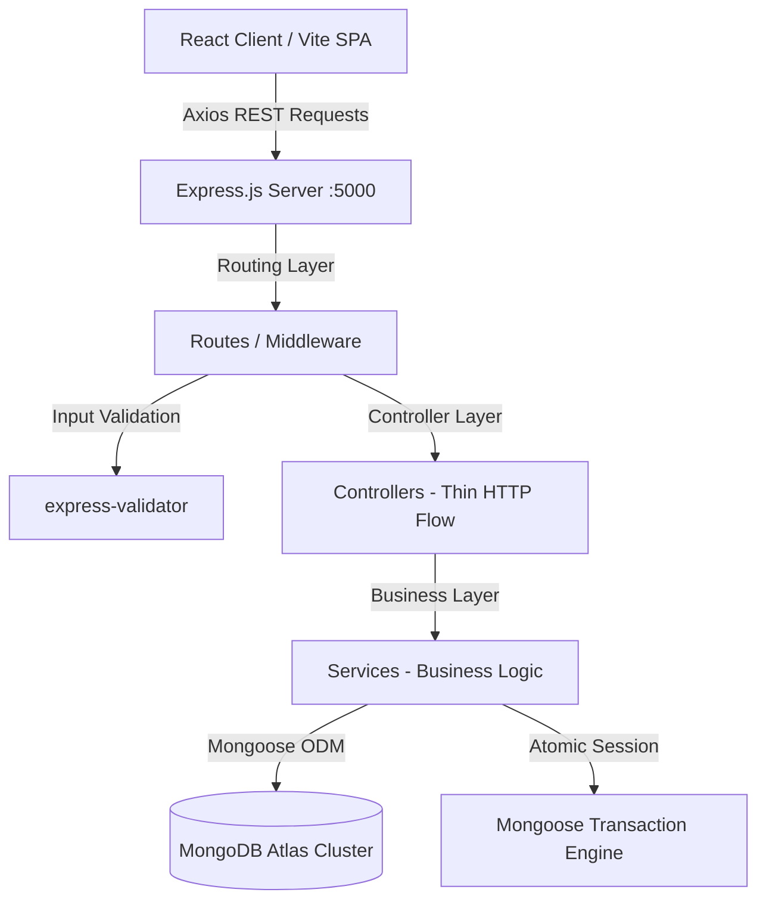

# 🎓 Nandhipriya Electricals — Student OBL Product Development Guide
## Outcome-Based Learning (OBL) Engineering Architecture & Codebase Map
**Target Level:** 3rd Year Computer Science & Engineering (Full-Stack Software Engineering)  
**Domain:** Enterprise Inventory Management, Point-of-Sale (POS) Billing & Analytics  
**Stack:** React 18 (Vite + TailwindCSS) + Node.js 18 (Express 4.x) + MongoDB Atlas (Mongoose 8.x)

---

## 🏛️ SYSTEM ARCHITECTURAL BLUEPRINT



---

## 📂 1. FRONTEND ARCHITECTURE (`/frontend`)

### 1.1 Core App Entry & Configuration
| File | What is it? | What can it do? | Why we use it? |
| :--- | :--- | :--- | :--- |
| [`src/main.jsx`](file:///e:/test_rat/HardWareKits_v0.1/frontend/src/main.jsx) | Root React DOM Mount Entry | Mounts the `<App />` tree to `#root` inside `index.html` with React StrictMode. | Standard Vite/React bootstrap pattern ensuring single-root virtual DOM lifecycle. |
| [`src/App.jsx`](file:///e:/test_rat/HardWareKits_v0.1/frontend/src/App.jsx) | Main Router & Layout Assembler | Defines client-side SPA routing (`react-router-dom`) across Dashboard, Billing, Products, Sales, and Stock Logs. | Eliminates full-page reloads and provides instant navigation between POS screens. |
| [`src/api/axiosConfig.js`](file:///e:/test_rat/HardWareKits_v0.1/frontend/src/api/axiosConfig.js) | Centralized HTTP Client | Pre-configures base URL (`http://localhost:5000/api`), timeout, and global response error interceptors. | DRY (Don't Repeat Yourself) principle — prevents duplicating URL and toast logic in 20+ files. |
| [`src/api/services.js`](file:///e:/test_rat/HardWareKits_v0.1/frontend/src/api/services.js) | Dynamic API Services Layer | Direct interface for all 22 REST endpoints (`productService`, `salesService`, `dashboardService`, `stockLogService`). | Normalizes backend envelopes `{ success, data, pagination }` so components consume clean data. |

---

### 1.2 Custom Hooks (`/frontend/src/hooks`)
| Hook | What is it? | What can it do? | Why we use it? |
| :--- | :--- | :--- | :--- |
| [`useProducts.js`](file:///e:/test_rat/HardWareKits_v0.1/frontend/src/hooks/useProducts.js) | Inventory State Controller | Manages product lists, pagination, categories, search queries, add, update, and soft-delete actions. | Keeps UI components stateless and focused strictly on rendering views while abstracting API lifecycles. |
| [`useSales.js`](file:///e:/test_rat/HardWareKits_v0.1/frontend/src/hooks/useSales.js) | Billing & Sales Ledger Hook | Manages bill creation, invoice retrieval, date-filtered sales ledger, and single bill population. | Encapsulates POS transaction submission and invoice state synchronization. |
| [`useDashboard.js`](file:///e:/test_rat/HardWareKits_v0.1/frontend/src/hooks/useDashboard.js) | Analytics Aggregator Hook | Executes parallel `Promise.all` queries for KPI summaries, 30-day revenue charts, and low-stock alerts. | Maximizes network efficiency by fetching all dashboard metrics in parallel. |

---

### 1.3 View Pages (`/frontend/src/pages`)
| Page | What is it? | What can it do? | Why we use it? |
| :--- | :--- | :--- | :--- |
| [`Dashboard.jsx`](file:///e:/test_rat/HardWareKits_v0.1/frontend/src/pages/Dashboard.jsx) | Executive KPI & Trends Screen | Renders real-time revenue cards, bill counts, low-stock threshold warning lists, and interactive Recharts area charts. | Provides shop managers instant operational clarity on inventory health and cash flow. |
| [`Billing.jsx`](file:///e:/test_rat/HardWareKits_v0.1/frontend/src/pages/Billing.jsx) | High-Speed POS Counter Screen | Fast product selection, live cart management, auto-calculated GST & discounts, and instant bill generation. | Optimizes checkout counter throughput with zero lag and live stock guards. |
| [`Products.jsx`](file:///e:/test_rat/HardWareKits_v0.1/frontend/src/pages/Products.jsx) | Master Inventory Catalogue | Full CRUD table with debounced search, category filter badges, pagination, modal forms, and soft-delete prompts. | Core inventory control plane for electrical stock management. |
| [`SalesHistory.jsx`](file:///e:/test_rat/HardWareKits_v0.1/frontend/src/pages/SalesHistory.jsx) | Historical Invoices Audit Screen | Date-range filtered sales archive with invoice item drilldown modals and PDF generation triggers. | Essential for GST tax filing, daily reconciliation, and customer dispute resolution. |
| [`StockLogs.jsx`](file:///e:/test_rat/HardWareKits_v0.1/frontend/src/pages/StockLogs.jsx) | Real-time Audit Trail | Color-coded ledger tracking every stock addition, sale decrement, and manual stock adjustment. | Complete transparency preventing stock shrinkage and inventory discrepancies. |

---

## ⚙️ 2. BACKEND ARCHITECTURE (`/backend`)

### 2.1 Server Core & Middleware (`/backend/middleware`)
| Module | What is it? | What can it do? | Why we use it? |
| :--- | :--- | :--- | :--- |
| [`server.js`](file:///e:/test_rat/HardWareKits_v0.1/backend/server.js) | Express Application Bootstrap | Initializes CORS, JSON parser, Morgan dev logger, connects MongoDB, mounts routes, and sets port 5000. | Master entry point binding the network stack to Express pipeline. |
| [`config/db.js`](file:///e:/test_rat/HardWareKits_v0.1/backend/config/db.js) | Database Connection Gateway | Establishes resilient Mongoose connection to MongoDB Atlas with connection listeners and exit handlers. | Decouples database connection logic from Express application lifecycle. |
| [`middleware/asyncHandler.js`](file:///e:/test_rat/HardWareKits_v0.1/backend/middleware/asyncHandler.js) | Async Exception Wrapper | Higher-Order Function wrapping async route handlers with `.catch(next)`. | Eliminates redundant `try/catch` boilerplate across all controller methods. |
| [`middleware/errorHandler.js`](file:///e:/test_rat/HardWareKits_v0.1/backend/middleware/errorHandler.js) | Centralized Error Formatter | Intercepts Mongoose `ValidationError`, `CastError`, duplicate key `code: 11000`, and standard errors. | Prevents server crashes and guarantees consistent `{ success: false, message }` JSON responses. |
| [`middleware/validate.js`](file:///e:/test_rat/HardWareKits_v0.1/backend/middleware/validate.js) | Schema Input Validator | Uses `express-validator` to enforce strict types, bounds (unit price $\ge 0$, phone regex, etc.). | Fail-fast validation at HTTP boundary before executing database writes. |

---

### 2.2 Controllers vs Services (3-Tier Layered Pattern)

```
[HTTP Request] ➔ [Controller (Request Parsing)] ➔ [Service (Business Logic / DB Queries)] ➔ [Mongoose Model]
```

#### Why we separate Controllers and Services?
1. **Controllers are Thin**: Only extract `req.params`, `req.query`, `req.body` and send HTTP status & JSON.
2. **Services are Pure**: Contain 100% of business logic, database queries, calculations, and atomic transactions.
3. **Unit Testable**: Services can be tested in isolation without needing mock HTTP request/response objects.

| Controller / Service Pair | Responsibility & Core Capabilities |
| :--- | :--- |
| [`productController.js`](file:///e:/test_rat/HardWareKits_v0.1/backend/controllers/productController.js) + [`productService.js`](file:///e:/test_rat/HardWareKits_v0.1/backend/services/productService.js) | Text regex search, category filtering, low-stock threshold queries (`$stockQty <= $reorderLevel`), soft-delete flag. |
| [`categoryController.js`](file:///e:/test_rat/HardWareKits_v0.1/backend/controllers/categoryController.js) + [`categoryService.js`](file:///e:/test_rat/HardWareKits_v0.1/backend/services/categoryService.js) | Category management with **Referential Integrity**: blocks category deletion if active products are assigned to it. |
| [`saleController.js`](file:///e:/test_rat/HardWareKits_v0.1/backend/controllers/saleController.js) + [`saleService.js`](file:///e:/test_rat/HardWareKits_v0.1/backend/services/saleService.js) | **ACID Atomic Transactions**: Validates stock $\to$ snapshots price/GST $\to$ creates sale $\to$ decrements stock $\to$ logs audit $\to$ commits session. |
| [`stockLogController.js`](file:///e:/test_rat/HardWareKits_v0.1/backend/controllers/stockLogController.js) + [`stockLogService.js`](file:///e:/test_rat/HardWareKits_v0.1/backend/services/stockLogService.js) | Audit trail listing, per-product movement history, manual quantity adjustments with validation. |
| [`dashboardController.js`](file:///e:/test_rat/HardWareKits_v0.1/backend/controllers/dashboardController.js) + [`dashboardService.js`](file:///e:/test_rat/HardWareKits_v0.1/backend/services/dashboardService.js) | High-performance MongoDB Aggregation Pipelines for daily sales, month-to-date revenue, and 30-day date buckets. |

---

## 🗄️ 3. DATABASE SCHEMA SPECIFICATIONS (`/backend/models`)

### 3.1 Category Model ([`models/Category.js`](file:///e:/test_rat/HardWareKits_v0.1/backend/models/Category.js))
- **Fields**: `name` (String, required, max 50), `description` (String, max 200).
- **Index**: Unique index with case-insensitive collation (`locale: 'en', strength: 2`) preventing duplicate entries like `"Wires"` and `"wires"`.

### 3.2 Product Model ([`models/Product.js`](file:///e:/test_rat/HardWareKits_v0.1/backend/models/Product.js))
- **Fields**: `name`, `category` (ObjectId ref Category), `brand`, `unit` (`piece|meter|box|coil|kg|set`), `unitPrice` (2 decimal places validator), `stockQty`, `reorderLevel`, `gstRate`, `barcode` (sparse unique), `isActive` (Boolean soft-delete).
- **Virtuals**: `isLowStock` ($\text{stockQty} \le \text{reorderLevel}$) dynamically evaluated without redundant DB storage.
- **Indexes**: Text index on `name`, compound index on `{ category: 1, isActive: 1 }` for instant catalog filters.

### 3.3 Sale Model ([`models/Sale.js`](file:///e:/test_rat/HardWareKits_v0.1/backend/models/Sale.js))
- **Embedded Schema**: `items: [{ product, productName, quantity, unitPrice, gstRate, lineTotal }]` — snapshots historical pricing at the time of sale.
- **Header Fields**: `billNumber` (`B-00001`), `customerName`, `customerPhone` (10-digit regex), `subTotal`, `totalGst`, `discountAmt`, `grandTotal`, `paymentMethod` (`cash|upi|card`).
- **Indexes**: Unique index on `billNumber`, reverse-chronological index on `createdAt` for high-speed ledger paging.

### 3.4 StockLog Model ([`models/StockLog.js`](file:///e:/test_rat/HardWareKits_v0.1/backend/models/StockLog.js))
- **Fields**: `product`, `productName`, `changeType` (`sale|purchase|adjustment|return`), `qtyChange`, `prevStock`, `newStock`, `referenceId`, `note`.
- **Indexes**: Compound index on `{ product: 1, createdAt: -1 }` for instant single-product ledger lookups.

---

## ⚡ 4. UTILITIES & TOOLS (`/backend/utils`)

1. **Auto-Increment Bill Number Generator** ([`utils/autoIncrement.js`](file:///e:/test_rat/HardWareKits_v0.1/backend/utils/autoIncrement.js)):
   - Query last invoice and increments sequential `B-00001`, `B-00002`, ...
   - Fully supports **Mongoose Transaction Sessions** to avoid collision during concurrent checkouts.

2. **Enterprise Database Seeder** ([`utils/seedData.js`](file:///e:/test_rat/HardWareKits_v0.1/backend/utils/seedData.js)):
   - Seeds 5 standard electrical categories and 15 realistic electrical products (Finolex wires, Havells LED, Legrand MCB, etc.).
   - Distributes stock quantities with 4 low-stock trigger items to test UI threshold alerts.
   - Creates initial inventory stock audit logs.

3. **Automated 22-Endpoint Test Suite** ([`test-all-endpoints.js`](file:///e:/test_rat/HardWareKits_v0.1/backend/test-all-endpoints.js)):
   - Single command `npm run test:all` executes automated assertion checks on every single route and transaction scenario.

---

## 🎓 KEY COMPUTER SCIENCE CONCEPTS DEMONSTRATED

1. **ACID Transactions**: Guarantee atomic execution in `createSale` using MongoDB replica set multi-document transactions.
2. **Referential Integrity**: Application-level foreign-key safety blocking category deletion when child products exist.
3. **Database Normalization & Denormalization Balance**: Normalized products and categories + denormalized embedded price snapshots in sales invoices.
4. **Debounced Search & Index Optimization**: Combined text indexing and query filtering to achieve sub-millisecond query execution.
5. **Decoupled 3-Tier Layered Architecture**: Clear separation of UI (React), Controller (HTTP), Service (Business Logic), and Model (Data Storage).
